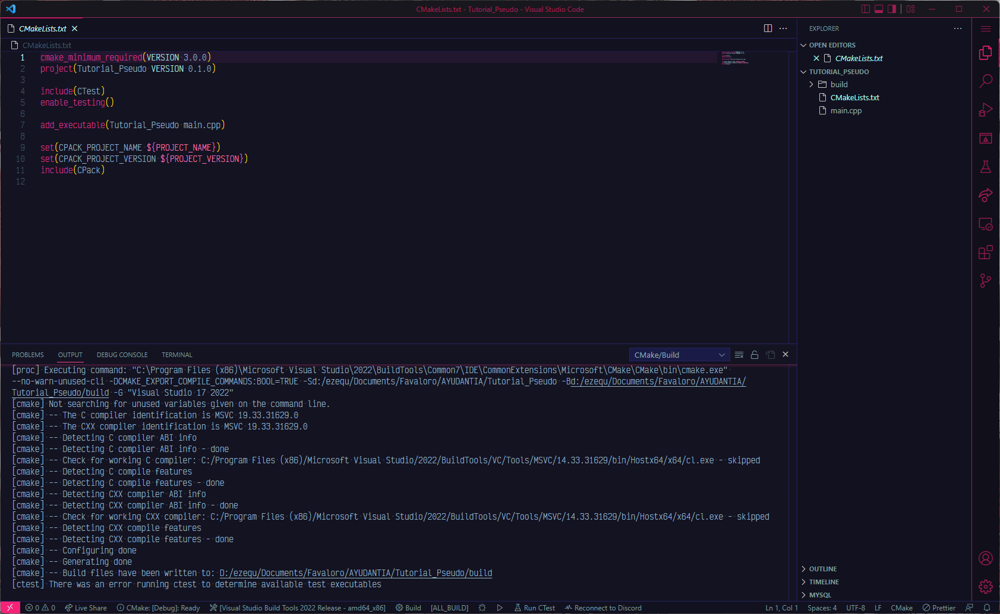

#### [Volver](https://github.com/eastanganelli/UF_FICEN_AYUDANTIA_IRI_2022_2C/tree/Clase_Practica)
---
# <u>Como instalar la libreria de PseudoCodeWrapper</u>

## Index
### [Projecto Tutorial_Psuedo](#Projecto-Tutorial_Psuedo)
### [Crear projecto de CMake](#Crear-projecto-de-CMake)
-  [Visual Studio 2022](#Visual-Studio-2022) - [Visual Studio Code](#Visual-Studio-Code)
### [Bajar la libreria](#Bajar-la-libreria)
### [Instalar libreria dentro del projecto](#Instalar-libreria-dentro-del-proyecto)
-  [Visual Studio 2022](#Visual-Studio-2022-Lib) - [Visual Studio Code](#Visual-Studio-Code-Lib)
---
<br>

### Projecto Tutorial_Psuedo
<p>Link hacía el projecto de ejemplo 👇👇</p>

[Click Aqui](./Tutoriales/Tutorial_PseudoEnCpp/Tutorial_Pseudo)

### De esta forma deberia verse el proyecto bien creado
``` text
Tutorial_Pseudo
+-- CMakeLists.txt
+-- Tutorial_Pseudo.h
+-- Tutorial_Pseudo.cpp
+-- <Otros archivos>
|
+-- out/build
    +-- <Muchas cosas>
```

<br>

## Crear projecto de CMake
### Visual Studio 2022


### Visual Studio Code



<br>

## Bajar la libreria
- Para bajar la libreria, haga click <b>[AQUI](https://github.com/eastanganelli/PseudoCodigoWrapper/releases)</b>
- Descargue el archivo `Source code (zip)`
- Descomprima el archivo dónde usted quiera, pero que recuerde como volver.
  - Si no sabe como descomprimir un archivo, aquí le dejo un tutorial<br> [Archivos ZIP: como Extraer o Descomprimir archivos en mi pc Windows 10 2022 sin programas de Erick Clavijo Morante](https://www.youtube.com/watch?v=QXirFf-MuKQ)

- El archivo descomprimido deberia tener este formato
```
PseudoCodigoWrapper-verion1.0.3
+-- PseudoCode
|   +-- CMakeLists.txt
|   +-- PseudoCodeWrapper.hpp
+-- demo
|   +-- <Archivos varios>
+-- test
|   +-- <Archivos varios>
+-- <Archivos varios>
```
- Acceda a la carpeta ya descomprimida y entre a PseudoCodeWrapper
  - Dentro de está carpeta tendrá que haber dos archivos:<br>`CMakeLists.txt`<br>`PseudoCodeWrapper.hpp`

<br>

## Instalar libreria dentro del proyecto
<i>Este proceso aplica igual para Visual Studio 2022 y Visual Studio Code</i>

- Abrimos la carpeta dónde se encuentra el proyecto y abrimos tambien la carpeta dónde esta guardado el archivo `PseudoCodeWrapper.hpp` (esto ya lo hicimos unos momentos antes).


- Copiamos el archivo `PseudoCodeWrapper.hpp`, dentro de la carpeta del proyecto que hicimos.<br>Si este paso se realizó de forma correcta, deberiamos verlo en el explorador de soluciones del Visual Studio Code como en el Visual Studio 2022<br><b>⚠️Si el Visual Studio 2022 tirar error, no nos alarmemos, ya lo solucionaremos en el siguiente paso!</b>


- Ahora viene el paso más importante.<br>Abrimos el archivo `CMakeLists.txt` y añadimos el nombre `PseudoCodeWrapper.hpp`  en add_executable ()

<u>Este CMakeLists.txt puede variar al que tengas, pero el formato deberia ser similar</u>

```
# CMakeList.txt : CMake project for Tutorial_Pseudo, include source and define
# project specific logic here.
#
cmake_minimum_required (VERSION 3.8)

project ("Tutorial_Pseudo")

# Add source to this project's executable.
add_executable (Tutorial_Pseudo "Tutorial_Pseudo.cpp" "Tutorial_Pseudo.h" "PseudoCodeWrapper.hpp")

if (CMAKE_VERSION VERSION_GREATER 3.12)
  set_property(TARGET Tutorial_Pseudo PROPERTY CXX_STANDARD 20)
endif()

# TODO: Add tests and install targets if needed.

```

- Ahora hacemos #include "PseudoCodeWrapper.hpp" en nuestro `main.cpp` o dónde tengamos la función `int main()`

- Felicidades, añadiste de forma exitosa la libreria!!!<br>Ahora a PROGRAMAR 🥳🎉🥳🎉

## En un futuro cercano, tendremos más cercania con CMake y sus utilidades.